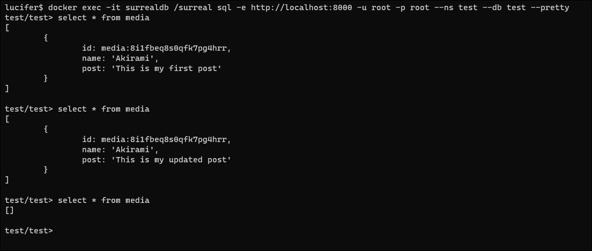

# Streamlit App with SurrealDB: CRUD Operations (Social Media Feed Application)

This starter kit explains how to use SurrealDB database to perform CRUD (Create, Read, Update, Delete) operations in a Streamlit Application. The application is a simple social media feed app, that allows users to interact with a database by adding, updating, and deleting data, and it displays the data retrieved from the database. In this example, we use a database to manage social media posts. All the operations take place in a table named `media`, created in SurrealDB

## Requirements

- Python 3.10.11
- [Pipenv](https://pipenv.pypa.io/en/latest/)
- [SurrealDB](https://surrealdb.com/)
- [Streamlit](https://streamlit.io/)

## Installation

1. **Install Pipenv**: If you haven't installed Pipenv, you can do so using pip:

   ```bash
   pip install pipenv
   ```

2. **Clone the Repository**: Clone the repository containing the Streamlit app and the `Pipfile` into your project directory.

3. **Install Dependencies**: Use Pipenv to install the required dependencies specified in the `Pipfile`:

   ```bash
   pipenv install
   ```

4. **Setting up SurrealDB with Docker**

   For just getting started with a development server running in memory, you can pass the container a basic initialization to set the user and password as root and enable logging.

   ```bash
   docker run --rm --pull always --name surrealdb -p 8000:8000 surrealdb/surrealdb:latest start --log trace --user root --pass root memory
   ```
   Access to the surrealdb CLI with:
   ```bash
   docker exec -it surrealdb /surreal sql -e http://localhost:8000 -u root -p root --ns test --db test --pretty
   ```

5. **Run the App**: Start the Streamlit app:

   ```bash
   pipenv run streamlit run app.py
   ```
   

## Functionalites for the Social Media Feed Application

The Streamlit app provides the following functionalities:

- **Create Data**: You can create new social media posts and these posts get stored in the database

- **Read Data**: The app allows you to view the data retrieved from the database. It displays a list of social media posts.

- **Update Data**: You can update the content of a post. The updated post is then stored in the database and will be displayed on the UI

- **Delete Data**: The app enables you to delete a post. This will then delete the post from the database and the post will be removed from the app
## Video Demonstrations

### Create Data

You can create new social media posts. Watch the video to see how it's done:

https://github.com/LuciAkirami/surrealdb-streamlit-starter-kit/assets/110820999/72736d14-6402-4536-8ff8-1b4ab07eab65

**Description:** The above video demonstrates the process of creating a new social media post in the app.

Create Data (Database Update)

https://github.com/LuciAkirami/surrealdb-streamlit-starter-kit/assets/110820999/a9ba2b18-6e8e-439a-8339-251a70757aa3

**Description:** In this video, you'll see how the created post is added to the SurrealDB database under `media` table. (the test/test represents the names of both namespace and the database)

### Update Data

You can update the content of a post. Watch the video to see how it's done:

https://github.com/LuciAkirami/surrealdb-streamlit-starter-kit/assets/110820999/ab276040-e09a-4313-9f15-cc697f1d73dc

**Description:** In this video, you'll see how to update the content of an existing social media post.

Update Data (Database Update)

https://github.com/LuciAkirami/surrealdb-streamlit-starter-kit/assets/110820999/d04c5c13-d70c-4317-a558-c80a6f7907c6

**Description:** This video showcases the updated data in the `media` table in the SurrealDB.

### Delete Data

The app enables you to delete a post. Watch the video to see how it's done:

https://github.com/LuciAkirami/surrealdb-streamlit-starter-kit/assets/110820999/7e858f44-0bdc-4b29-b4c0-43f8ffe930be

**Description:** In this video, you'll see how to delete a social media post from the app.

Delete Data (Database Update)



**Description:** In the above image, we can see that the post is deleted from the `media` table
